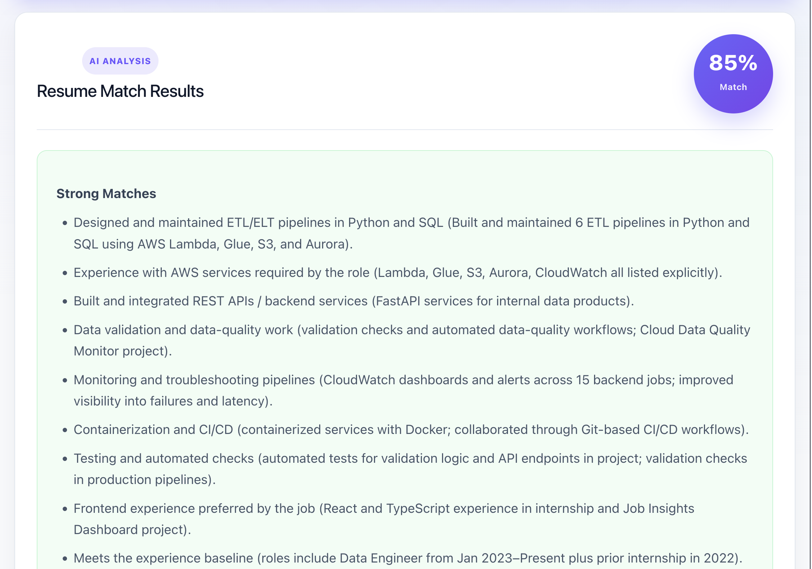
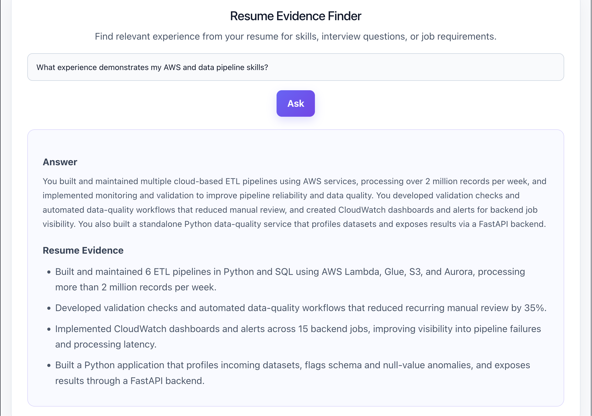
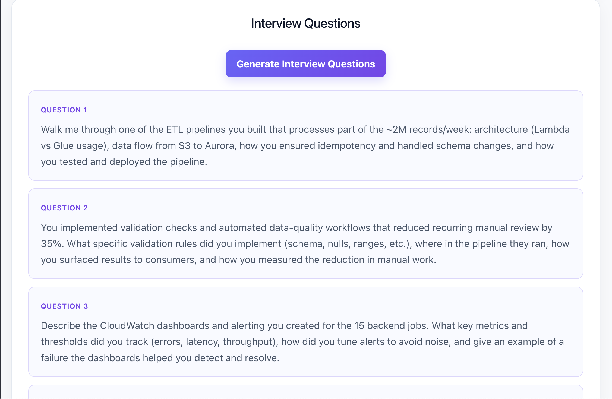
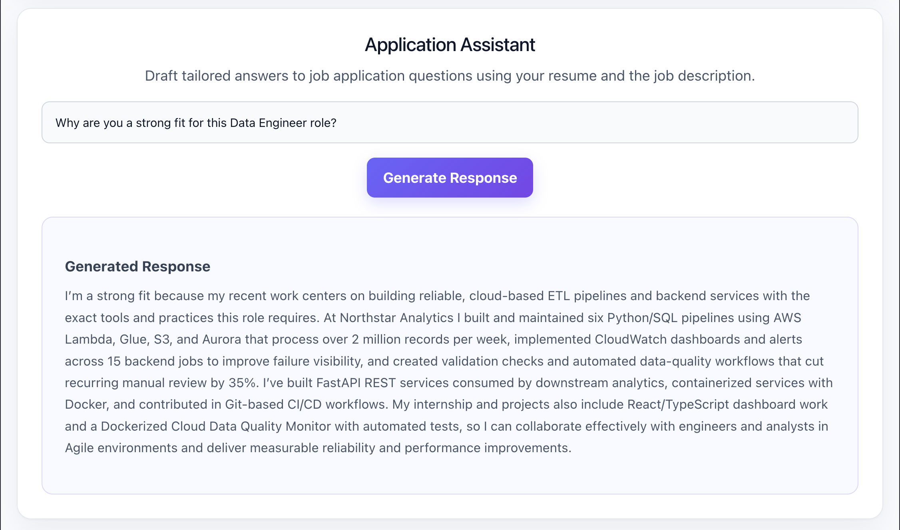
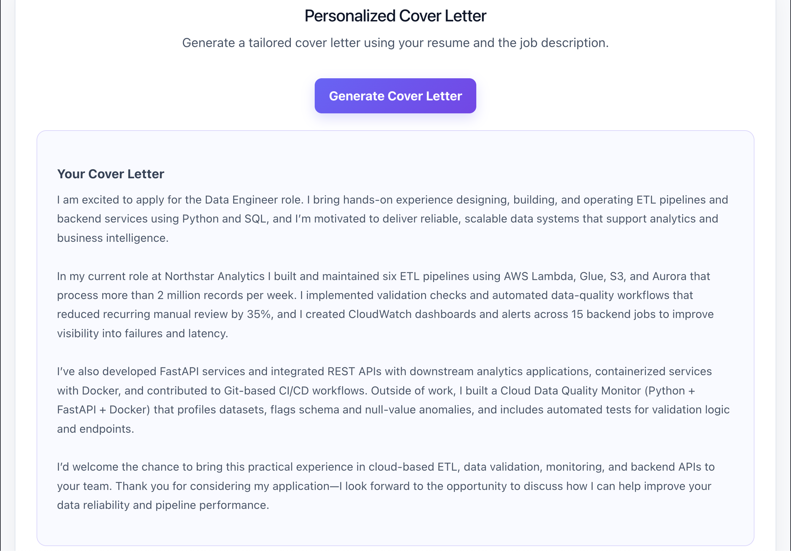
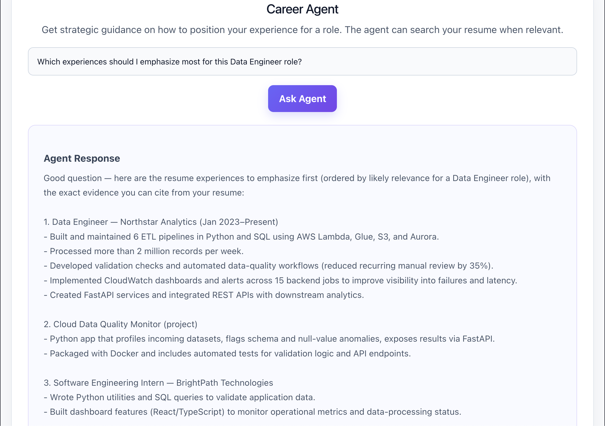

# AI Job Search Copilot

An AI-powered job search assistant that helps job seekers evaluate their fit for a role and prepare stronger, evidence-based applications.

Users can upload a resume and job description to analyze skill alignment, identify gaps, retrieve relevant resume evidence, generate tailored interview questions and application responses, create personalized cover letters, and receive career guidance through an AI agent with resume-search capabilities.

## Live Demo

[Try the AI Job Search Copilot](https://ai-job-search-copilot-ten.vercel.app)

## Screenshots

### Resume–Job Match Analysis



The copilot compares a candidate's resume against a job description and identifies strong matches, partial matches, missing skills, and grounded recommendations.

### Resume Evidence Finder



Semantic retrieval finds relevant resume evidence to answer targeted questions without inventing candidate experience.

### Interview Question Generator



Generates tailored interview questions using the job description and relevant resume evidence.

### Application Assistant



Drafts grounded responses to job application questions using the candidate's actual resume evidence.

### Personalized Cover Letter



Generates a concise cover letter tailored to the candidate's resume and target role.

### AI Career Agent



Provides strategic career guidance and can search the candidate's resume for supporting evidence when needed.

## Why I Built This

Job descriptions often contain long lists of requirements, while a candidate's relevant experience may be scattered across different roles, projects, and skills on their resume.

I built AI Job Search Copilot to help job seekers connect those two sources of information. The application uses AI and semantic retrieval to identify relevant resume evidence, evaluate job alignment, and help candidates prepare tailored application materials without inventing experience they do not have.

The project also explores where different AI architectures are most useful: full-context analysis for holistic resume matching, RAG for targeted evidence retrieval, structured outputs for predictable analysis, and tool calling for agentic workflows.

## Features

- **Resume–Job Match Analysis** — Compares a resume against a job description and returns a structured match score, strong matches, partial matches, missing skills, and grounded recommendations.

- **Grounded AI Analysis** — Uses explicit resume evidence and grounding rules to reduce hallucinations and avoid inventing unsupported skills, experience, or achievements.

- **Resume Evidence Finder (RAG)** — Uses embeddings and semantic retrieval to surface relevant resume experience for skills, interview questions, and job requirements.

- **Interview Question Generator** — Generates tailored interview questions based on the candidate's resume and target job description.

- **Application Assistant** — Drafts personalized responses to job application questions using resume evidence and the target role.

- **Personalized Cover Letter Generator** — Creates a role-specific cover letter using relevant experience from the candidate's resume and the job description.

- **AI Career Agent** — Uses tool/function calling to determine when resume retrieval is needed and dynamically searches resume evidence to provide grounded career guidance.

## Tech Stack

### Frontend
- React
- TypeScript
- Vite

### Backend
- Python
- FastAPI
- Pydantic

### AI / LLM
- OpenAI API
- Structured Outputs
- Embeddings
- Retrieval-Augmented Generation (RAG)
- Tool / Function Calling
- Agentic Workflows

### Data & Retrieval
- ChromaDB
- Semantic Search
- PDF Text Extraction

### Deployment
- Vercel — frontend hosting
- Render — backend hosting
- GitHub — version control and source repository

## Architecture

The application separates the frontend, backend, AI workflows, and retrieval layer:

1. The **React + TypeScript frontend** collects the resume, job description, and user requests.
2. The **FastAPI backend** handles PDF extraction, API requests, AI orchestration, and retrieval logic.
3. Resume content is split into chunks and converted into vector embeddings using the **OpenAI Embeddings API**.
4. Embeddings are stored in **ChromaDB** for semantic retrieval.
5. The **RAG workflow** retrieves relevant resume chunks for evidence-grounded resume Q&A.
6. **OpenAI structured outputs** provide validated resume–job match analysis.
7. The **Career Agent** uses tool/function calling to determine when resume retrieval is necessary before generating a response.
8. The frontend is deployed on **Vercel**, while the FastAPI backend is deployed on **Render**.

### System Flow
```text
User
  ↓
React + TypeScript Frontend (Vercel)
  ↓
FastAPI Backend (Render)
  │
  ├── Resume–Job Match
  │      └── Full Resume + Job Description
  │              ↓
  │         OpenAI Structured Output
  │
  ├── Resume Evidence Finder
  │      └── RAG / Semantic Search
  │
  ├── Interview Question Generator
  │      └── Retrieved Resume Evidence + Job Description
  │
  ├── Application Assistant
  │      └── Retrieved Resume Evidence + Job Description
  │
  ├── Personalized Cover Letter
  │      └── Retrieved Resume Evidence + Job Description
  │
  └── AI Career Agent
         └── Tool / Function Calling
                  ↓
             Resume Search
                  ↓
       OpenAI Embeddings → ChromaDB
                  ↓
         Relevant Resume Evidence
                  ↓
           Grounded Response
```

## RAG Design Decision

During development, two approaches were evaluated for resume analysis:

- **Full-resume context** for holistic resume-to-job matching
- **Retrieval-Augmented Generation (RAG)** for targeted resume questions

RAG retrieval works well for targeted tasks because semantic search can retrieve the resume chunks most relevant to a specific skill, requirement, or question.
For this reason, the application uses:

- **Full resume context** for overall resume–job match analysis
- **RAG retrieval** for the Resume Evidence Finder and other workflows that require targeted resume evidence
## Grounding & Hallucination Mitigation

Because resume recommendations can become misleading if an LLM invents experience, the application includes explicit grounding rules throughout its AI workflows.

The system instructs the model to:

- Use only experience explicitly supported by the candidate's resume
- Avoid inventing skills, tools, responsibilities, or achievements
- Identify unsupported job requirements as missing or not demonstrated
- Avoid recommending resume bullets that falsely claim experience
- Ground resume Q&A responses in retrieved resume evidence

For resume–job analysis, responses are also returned using a defined Pydantic schema, providing a predictable structure for match scores, strong matches, partial matches, missing skills, and recommendations.


## Local Development

### 1. Clone the repository

```bash
git clone https://github.com/svnannur-rgb/ai-job-search-copilot.git
cd ai-job-search-copilot
```

### 2. Start the backend

```bash
cd backend
python3 -m venv .venv
source .venv/bin/activate
pip install -r requirements.txt
```

Create a `.env` file inside `backend/` and add:

```text
OPENAI_API_KEY=your_openai_api_key
```

Then start FastAPI:

```bash
uvicorn main:app --reload
```

### 3. Start the frontend

In a separate terminal:

```bash
cd frontend
npm install
npm run dev
```

By default, the frontend connects to the local FastAPI server. For a deployed backend, set `VITE_API_URL` in the frontend environment.

