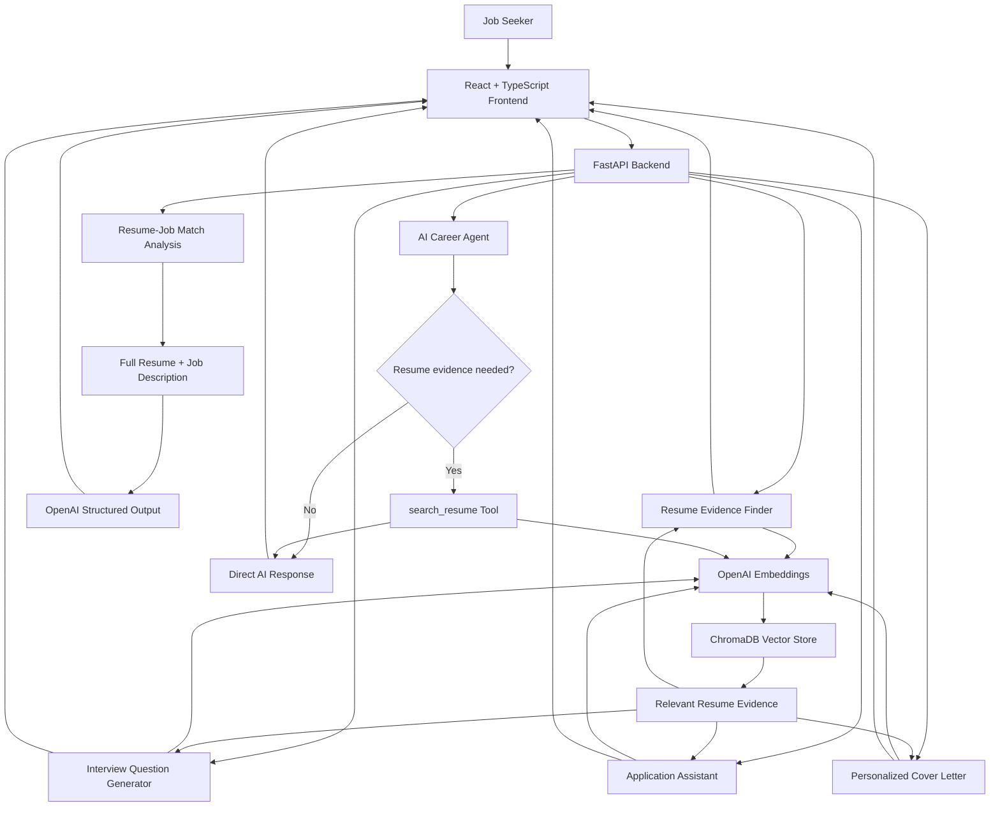

# AI Job Search Copilot — System Architecture

```mermaid
flowchart TD
    U[Job Seeker] --> FE[React + TypeScript Frontend]
    FE --> API[FastAPI Backend]

    API --> MATCH[Resume-Job Match Analysis]
    API --> RAG[Resume Evidence Finder]
    API --> INT[Interview Question Generator]
    API --> APP[Application Assistant]
    API --> COVER[Personalized Cover Letter]
    API --> AGENT[AI Career Agent]

    MATCH --> FULL[Full Resume + Job Description]
    FULL --> STRUCT[OpenAI Structured Output]

    RAG --> EMB[OpenAI Embeddings]
    INT --> EMB
    APP --> EMB
    COVER --> EMB

    EMB --> VECTOR[ChromaDB Vector Store]
    VECTOR --> RETRIEVE[Relevant Resume Evidence]

    RETRIEVE --> RAG
    RETRIEVE --> INT
    RETRIEVE --> APP
    RETRIEVE --> COVER

    AGENT --> TOOL{Resume evidence needed?}
    TOOL -->|Yes| SEARCH[search_resume Tool]
    SEARCH --> EMB
    TOOL -->|No| RESPONSE[Direct AI Response]
    SEARCH --> RESPONSE

    STRUCT --> FE
    RAG --> FE
    INT --> FE
    APP --> FE
    COVER --> FE
    RESPONSE --> FE
```